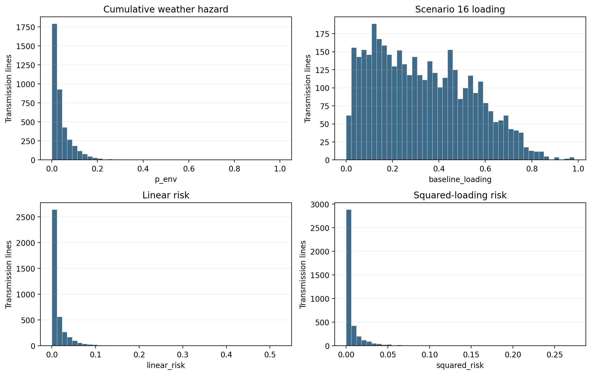
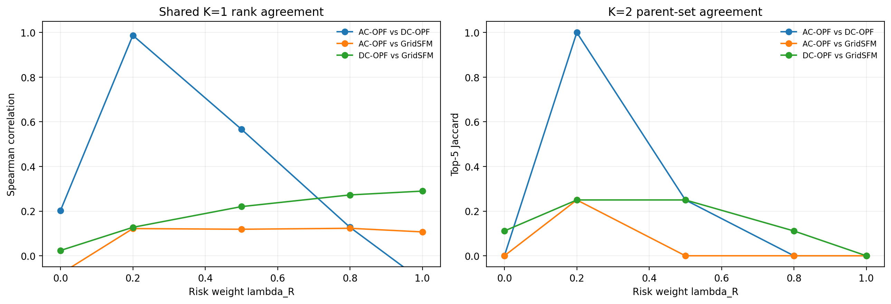
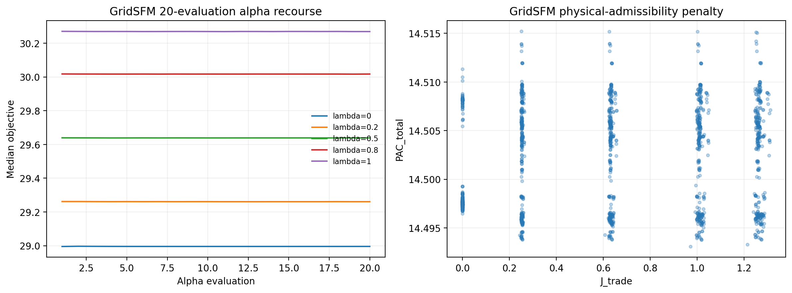
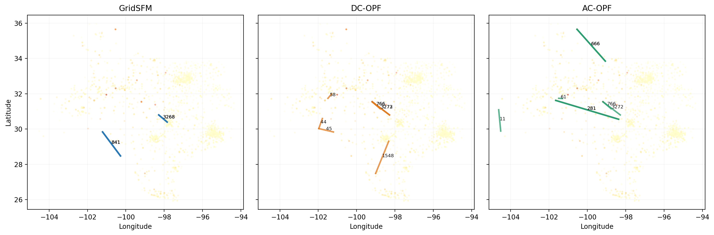
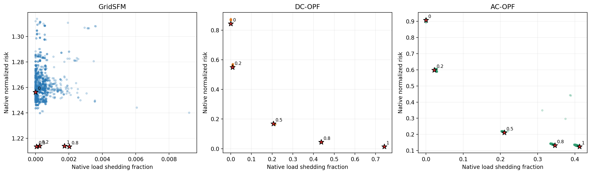
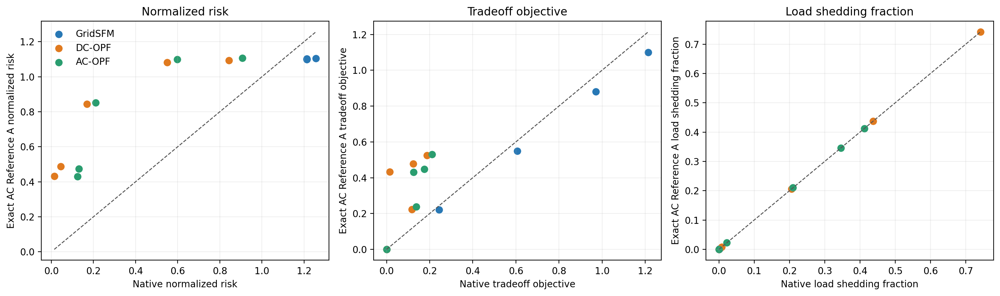
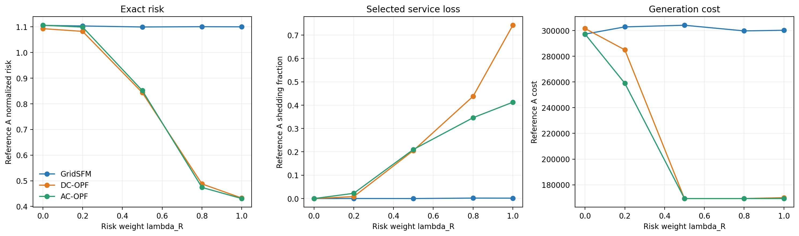
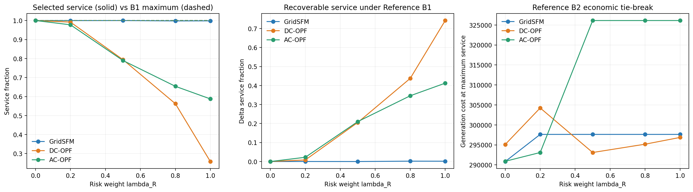
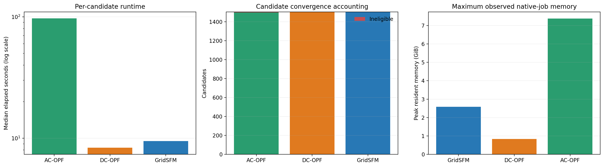
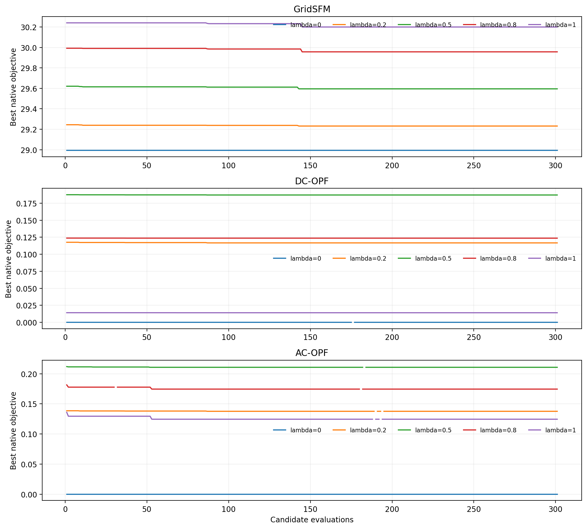

# Stage K Texas2k Production Analysis

## Executive conclusion

The production study completed and passed final validation. It evaluated 4,515
states (1,505 per evaluator), retained 4,507 eligible states, sealed 15
finalists, and completed all 15 AC Reference A and Reference B1/B2 studies.
Every B1 and B2 solve was solver-eligible; the final validation report has no
failed checks or warnings.

The three screening methods do **not** produce interchangeable decisions.
GridSFM selects one stable two-line topology for every positive risk weight and
retains 99.80-99.99% of load in exact AC evaluation, but obtains almost no exact
AC risk reduction. DC-OPF and direct AC-OPF select progressively higher-risk
lines as `lambda_R` increases and obtain large exact risk reductions, but their
selected recourse sheds 20-74% (DC) and 21-41% (AC) at `lambda_R >= 0.5`.
Reference B1 proves that every selected topology can serve essentially 100% of
demand. The lost service is therefore a property of the optimized continuous
decision, not an unavoidable consequence of opening those lines.

## Frozen methodology

### Environment and objective

The experiment uses modified Texas2k Scenario 16 at the peak-loading hour and
June 23, 2023 at 16:00 CDT weather. Branch hazard is cumulative Fosberg-derived
`p_env`. The frozen baseline is the validated stored Scenario-16 loading, not a
new AC solution. For every energized switchable transmission line,

`R = sum(p_env,l * loading_l^2)` and `R_norm = R / R_base`,

with `R_base = 32.975425699285616`. The native tradeoff is
`J_trade = lambda_R R_norm + (1-lambda_R) L_shed`. GridSFM alone is ranked by
`J_total = J_trade + 2 PAC_total`, where `PAC_total` combines operational and AC
admissibility penalties. Squared loading intentionally emphasizes overloads
above 1.0 while attenuating loading below 1.0 relative to a linear term.

Across 3,993 switchable transmission lines, median `p_env` is 0.026, its 95th
percentile is 0.150, and its maximum is 1.0. Median baseline loading is 0.306;
the maximum is 0.983. Squared-risk contributions are concentrated: the median
is 0.00179, the 99th percentile is 0.0946, and the maximum is 0.2736.

### Topology search

For each of five `lambda_R` values (`0, 0.2, 0.5, 0.8, 1.0`), all evaluators
receive the same 50 K=1 candidates. Each evaluator ranks those candidates using
its own native objective, selects five parents, and generates up to 50 K=2
children per parent, capped at 250 unique K=2 candidates. Including intact K=0,
this gives 301 states per evaluator/lambda and 1,505 per evaluator.

The shared K=1 rankings diverge materially. Mean Spearman agreement is 0.354
for AC versus DC, 0.078 for AC versus GridSFM, and 0.187 for DC versus GridSFM.
Mean top-five-parent Jaccard overlap is 0.25, 0.05, and 0.144, respectively.
Thus evaluator-specific K=2 exploration is consequential, not a cosmetic second
stage.

### Continuous evaluation

- **GridSFM:** the released `microsoft/GridSFM_Open` v1.1 checkpoint runs on one
  V100. For each topology it performs the frozen 20-evaluation alpha search over
  five selected loads (`q=5`) and ranks by `J_total`. Its reported status is
  `model_output_penalized`, meaning PAC is part of selection rather than a claim
  of exact AC feasibility.
- **DC-OPF:** PowerModels/Ipopt jointly solves DC generation, angles, flows, and
  load-service variables for each fixed topology. It has no reactive power or
  voltage-magnitude representation.
- **AC-OPF:** PowerModels/Ipopt jointly solves the nonlinear AC operating state
  and load-service variables for each fixed topology. It is an exact-model
  screening solve, but Reference A remains the common sealed-finalist audit.

GridSFM's selected states retain the following overload diagnostics. These are
native model predictions used by PAC, not Reference A AC loadings:

| `lambda_R` | Selected topology | Maximum predicted loading | Lines above 1.0 |
|---:|---|---:|---:|
| 0.0 | intact | 12.957 | 128 |
| 0.2 | 841;3268 | 9.841 | 112 |
| 0.5 | 841;3268 | 9.843 | 112 |
| 0.8 | 841;3268 | 9.600 | 111 |
| 1.0 | 841;3268 | 9.647 | 111 |

The repeated topology reduces the predicted overload count relative to intact,
but remains strongly inadmissible. This explains the nearly constant
`PAC_total` near 14.49 and prevents interpreting the native GridSFM states as
AC-feasible operating points. Reference A economically redispatches each state
and returns a maximum AC loading of approximately 1.0 with no AC overloads.

## Native search results

All positive-weight finalists use K=2. GridSFM uses intact topology at
`lambda_R=0` and line pair `841;3268` for all four positive weights. DC uses
five different pairs (`44;58`, `3272;3273`, `766;3272`, `45;766`, and
`766;1548`). AC uses `11;61`, then `766;3272`, and stabilizes on `281;666` for
weights 0.5-1.0.

The geographic pattern is interpretable. At high weights, AC opens lines 281
and 666, whose `p_env` values are 1.000 and 0.670 and squared-risk contributions
are 0.274 and 0.149. DC's high-weight choices include line 1548 (`p_env=0.650`,
loading 0.616) and line 766 (`p_env=0.186`, loading 0.739). GridSFM's stable
pair also targets elevated hazard/risk: line 841 has `p_env=0.687`, and line
3268 has loading 0.711. Full endpoints and metrics are retained in
`analysis/tables/finalist_opened_lines.csv`.

## Exact AC Reference A

Reference A fixes each sealed topology and its selected load-service vector,
then solves an economic AC-OPF. It recomputes risk across **every energized
switchable transmission line**, not only the opened lines. Consequently,
Reference A service equals native selected service by construction, while risk,
flows, voltages, dispatch, and generation cost are independently audited.

GridSFM native risk overestimates exact risk by 0.111-0.151 (`delta_R_A > 0`).
DC and AC screening substantially underestimate exact risk: their
`delta_R_A = native - exact` ranges are -0.675 to -0.249 and -0.640 to -0.198.
This is the main reason native objective values must not be compared across
evaluators as though they share one physical scale.

Under exact AC evaluation, GridSFM risk remains nearly flat at 1.099-1.103 for
positive weights, versus intact 1.105. DC reaches 0.844, 0.488, and 0.433 at
weights 0.5, 0.8, and 1.0, while AC reaches 0.852, 0.474, and 0.431. These risk
reductions accompany substantial selected load shedding.

The Reference A economic number is generation cost for the fixed served-load
decision, not a social-cost objective with value of lost load. Its decline to
about 169,327 for heavily shedding DC/AC decisions is therefore not an economic
benefit: less generation is purchased because less demand is served. Cost must
be interpreted together with service, or replaced by a future value-of-lost-load
formulation for welfare conclusions.

## Exact AC Reference B

Reference B1 fixes the topology but re-optimizes load service to certify maximum
AC-feasible delivery. Reference B2 fixes that maximum service and minimizes
generation cost as an economic tie-break. All 15 B1 and B2 solves succeeded, so
no fallback or unavailable B2 cost occurs in this run.

Every B1 maximum-service fraction is numerically 1.0. The recoverable service
gap is negligible for GridSFM (0.00005-0.00202), but rises with risk weight for
DC (0.00834, 0.20564, 0.43762, 0.74197) and AC (0.02246, 0.21022, 0.34609,
0.41247). This establishes that the Texas2k topology choices themselves did not
force the reported shedding. A future formulation can seek these risk-reducing
topologies while imposing a stronger service floor or a better calibrated
service penalty.

The risk values change substantially when Reference B restores maximum service:

| Evaluator | `lambda_R` | Reference A risk | Reference B risk | B minus A |
|---|---:|---:|---:|---:|
| GridSFM | 0.0 | 1.105495 | 1.117704 | +0.012210 |
| GridSFM | 0.2 | 1.103221 | 1.103704 | +0.000483 |
| GridSFM | 0.5 | 1.099373 | 1.103704 | +0.004332 |
| GridSFM | 0.8 | 1.100483 | 1.103704 | +0.003221 |
| GridSFM | 1.0 | 1.099912 | 1.103704 | +0.003793 |
| DC-OPF | 0.0 | 1.092810 | 1.104224 | +0.011414 |
| DC-OPF | 0.2 | 1.082205 | 1.092241 | +0.010036 |
| DC-OPF | 0.5 | 0.843562 | 1.104661 | +0.261099 |
| DC-OPF | 0.8 | 0.487707 | 1.100152 | +0.612445 |
| DC-OPF | 1.0 | 0.432745 | 1.166201 | +0.733456 |
| AC-OPF | 0.0 | 1.106082 | 1.117893 | +0.011811 |
| AC-OPF | 0.2 | 1.098969 | 1.104661 | +0.005692 |
| AC-OPF | 0.5 | 0.851615 | 1.084147 | +0.232532 |
| AC-OPF | 0.8 | 0.474089 | 1.084147 | +0.610058 |
| AC-OPF | 1.0 | 0.430677 | 1.084147 | +0.653470 |

Because every B2 solve is eligible, `Reference B risk` is measured from the B2
economic tie-break state at the maximum service certified by B1. For GridSFM,
restoring the tiny amount of shed load changes risk by less than 0.4% at every
positive weight. For DC and AC, restoring service at high weights raises risk
by 27-169% relative to Reference A and returns it to roughly 1.08-1.17. Thus,
most of their striking high-weight Reference A risk reduction is enabled by
aggressive load shedding. The selected topologies remain fully service-capable,
but topology alone does not preserve the low-risk operating point under
maximum-service economic dispatch.

The retained numerical source is
`analysis/tables/reference_b_risk_comparison.csv`.

## Reliability and computational performance

GridSFM retained 1,505/1,505 candidates, DC 1,504/1,505, and AC 1,498/1,505.
AC retained four evaluator exceptions, two numerical failures, and one time
limit as explicit ineligible rows; DC retained one evaluator exception. No
failed row was silently promoted. One AC array task required infrastructure
recovery after an 8 GB Slurm memory request proved insufficient; it resumed
from deterministic checkpoints at 16 GB without changing methodology.

Median end-to-end candidate time was 9.49 s for GridSFM, 8.35 s for DC, and
97.26 s for AC. Summed candidate evaluation time was 4.03, 5.22, and 44.51
hours, respectively. GridSFM and DC were therefore similar per candidate in
this implementation, while AC was about 10-12 times slower. GridSFM benefited
from the V100 and learned inference; DC's wall time includes Julia/job and
data-handling overhead beyond its mean 1.38 s solver time.

## Interpretation and limits

1. The methodology is operational at Texas2k scale and all exact reference
   gates passed, but evaluator choice strongly changes the explored K=2 region.
2. GridSFM is service-conservative but did not discover meaningful exact risk
   reduction with the released checkpoint and frozen alpha/PAC procedure.
3. DC and AC identify decisions with large exact risk reduction, but the chosen
   continuous recourse is too willing to shed load. Reference B shows that this
   is correctable without abandoning those topologies.
4. Direct AC screening does not remove the need for a sealed exact audit: its
   native-versus-reference risk discrepancies remain large, reflecting the
   distinct screening and reference formulations/states.
5. This is one peak-load/weather snapshot, without N-1 contingencies, critical
   facilities, value of lost load, or hazard uncertainty. Those remain planned
   extensions rather than claims supported by this run.

The strongest immediate next study is a service-constrained or economically
calibrated recourse formulation applied to the same frozen candidate protocol,
followed by contingency testing of the exact-reference finalists. Hazard
quantiles and critical-load geography can then be added without confounding the
present evaluator comparison.

## Evidence index

- Primary PACE package: `stage_k_production_v001/`
- Hash-matched deployed configuration: `deployed_full.yaml`
- Final validation: `stage_k_production_v001/validation/production_validation_report.json`
- Candidate/finalist evidence: `stage_k_production_v001/evaluators/`
- Exact references: `stage_k_production_v001/references/`
- Derived source tables: `analysis/tables/`
- Figures in PNG and PDF: `analysis/figures/`
- Reproducible code: `stage_k_case_study/src/post_run_analysis.py`
