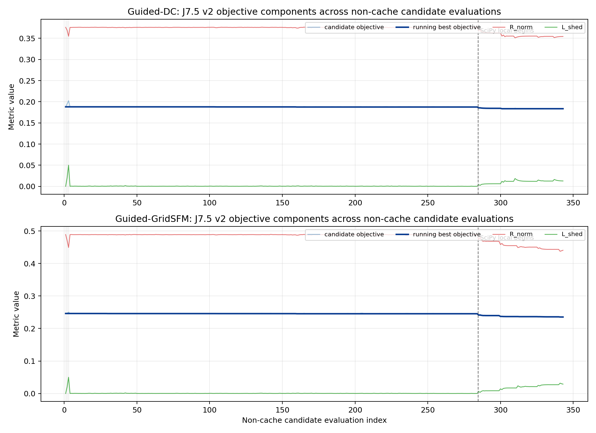

# J7.5 v2 Screened SciPy Alpha Status

## Status

`J7_5_V2_SCREENED_SCIPY_ALPHA_SMOKE_COMPLETE`

This pass implements the requested v2 alpha method for the fixed topology
`{285, 473}` under `J-S1`, `lambda_R = 0.5`.

The v1 coordinate-only alpha smoke is preserved. v2 artifacts are written under:

```text
C:\Users\Caleb Lu\.gridfm_stage_j\cache\stage_j\j7_5_full_alpha_v2\
  J-S1_lambda0p5_topology_285_473\
    guided_dc\
    gridsfm\
```

## Implemented Method

The locked Stage J decision space remains full per-load alpha:

```text
alpha_i in [0, 1] for every load i in D.
```

v2 does not replace this with a global, zonal, or block alpha. Instead, it uses
a tractability screen:

1. Evaluate full-vector seed points.
2. For every controllable load, evaluate a one-coordinate downward perturbation
   with `screen_delta = 0.10`.
3. Rank loads by objective improvement.
4. For each `q in {5, 10, 20}`, run bounded `scipy.optimize.minimize` on only
   the selected top-q alpha coordinates.
5. All unselected load alphas remain explicit and fixed at the incumbent value.

Default v2 smoke settings:

```text
B_alpha = 500
screen_delta = 0.10
q_values = 5, 10, 20
scipy_method = Powell
scipy_maxfev_per_q = 60
alpha_round_decimals = 6
```

Guided-DC selection minimizes:

```text
J_trade = lambda_R R_norm^DC + (1 - lambda_R) L_shed_total.
```

Guided-GridSFM selection minimizes:

```text
J_total = J_trade + rho_phys PAC_total.
```

with frozen PAC weights:

```text
rho_phys = 2.0
w_op = 1.0
w_AC = 1.0
w_model = 0.0
```

## Code Changes

Added optimizer API:

```text
experiments/test/wildfire_tests/stage_j_gridsfm_goc500/alpha_optimizer.py
  ScreenedScipyAlphaConfig
  ScreenedScipyAlphaResult
  optimize_screened_scipy_alpha
```

Added smoke runners:

```text
experiments/test/wildfire_tests/stage_j_gridsfm_goc500/run_j7_5_v2_guided_dc_alpha_smoke.py
experiments/test/wildfire_tests/stage_j_gridsfm_goc500/run_j7_5_v2_gridsfm_alpha_smoke.py
```

Added test coverage:

```text
tests/test_wildfire_stage_j_gridsfm_goc500.py
  test_screened_scipy_alpha_uses_coordinate_screen_then_local_subset
```

## Smoke Results

### Guided-DC v2

```text
termination_reason = completed
actual_evaluation_count = 343
unique_alpha_count = 343
cache_hit_count = 121
screening_best_improved = true
source_less_load_ids = none
```

Best Guided-DC v2 finalist:

```text
J_trade = 0.18352239203075255
R_norm = 0.35453672312554496
L_shed_total = 0.012508060935960137
L_shed_control = 0.012508060935960137
L_shed_island = 0.0
DC max loading = 0.9999999999918557
DC overloaded lines = 0
```

Selected load sets:

```text
q=5:  202, 157, 158, 102, 215
q=10: 202, 157, 158, 102, 215, 152, 156, 220, 101, 165
q=20: 202, 157, 158, 102, 215, 152, 156, 220, 101, 165,
      167, 154, 153, 225, 150, 224, 115, 69, 155, 206
```

Reference A fixed-`z,alpha` economic AC-OPF:

```text
termination_status = LOCALLY_SOLVED
objective = 449205.52600691817
runtime_seconds = 7.797999858856201
max_ac_loading = 1.0000000049905922
num_ac_loading_gt_1 = 2
missing_alpha_load_count = 0
```

### Guided-GridSFM v2

```text
termination_reason = completed
actual_evaluation_count = 343
unique_alpha_count = 343
cache_hit_count = 121
screening_best_improved = true
source_less_load_ids = none
```

Best Guided-GridSFM v2 finalist:

```text
J_total = 0.2353742334762615
J_trade = 0.2346042722347031
R_norm = 0.43921963595154534
L_shed_total = 0.02998890851786084
L_shed_control = 0.02998890851786084
L_shed_island = 0.0
PAC_operational = 0.0001671330643371501
PAC_AC = 0.00021784755644205234
PAC_model = 0.0
PAC_total = 0.00038498062077920245
GridSFM predicted max loading = 1.2272194886202552
GridSFM predicted overloaded lines = 6
feasibility_head = 0.9852403402328491
```

Selected load sets:

```text
q=5:  157, 167, 158, 215, 154
q=10: 157, 167, 158, 215, 154, 165, 102, 152, 101, 156
q=20: 157, 167, 158, 215, 154, 165, 102, 152, 101, 156,
      151, 155, 220, 150, 27, 171, 166, 153, 69, 206
```

Reference A fixed-`z,alpha` economic AC-OPF:

```text
termination_status = LOCALLY_SOLVED
objective = 432050.8578183267
runtime_seconds = 7.6519999504089355
max_ac_loading = 1.0000000049741387
num_ac_loading_gt_1 = 1
missing_alpha_load_count = 0
```

## Comparison To v1 Coordinate-Only Smoke

v1 exhausted the 300-evaluation budget after one full coordinate sweep and one
accepted coordinate move for both methods.

v2 completed because the expensive all-load screen is only performed once, then
SciPy refines a selected subset. For the same topology/scenario:

```text
Guided-DC v1:
  J_trade = 0.18749648549425
  R_norm = 0.3743761863212993
  L_shed_total = 0.0006167846672006441

Guided-DC v2:
  J_trade = 0.18352239203075255
  R_norm = 0.35453672312554496
  L_shed_total = 0.012508060935960137

Guided-GridSFM v1:
  J_total = 0.24546045825417565
  J_trade = 0.24398344940487984
  R_norm = 0.4870372601618728
  L_shed_total = 0.0009296386478868643
  PAC_total = 0.0007385044246478992

Guided-GridSFM v2:
  J_total = 0.2353742334762615
  J_trade = 0.2346042722347031
  R_norm = 0.43921963595154534
  L_shed_total = 0.02998890851786084
  PAC_total = 0.00038498062077920245
```

Interpretation: v2 finds better scalar objectives for both methods by allowing
multi-load curtailment in the screened subset. The improvement comes with more
controlled load shedding, so Pareto reporting must continue to show
`R_norm` and `L_shed_total` separately rather than only reporting `J`.

## Candidate Trace Figure

The figure below plots non-cache candidate evaluations only. It shows the
candidate objective, running best objective, `R_norm`, and `L_shed` for both
Guided-DC and Guided-GridSFM. The vertical dashed line marks the transition
from the all-load coordinate screen to the SciPy-local refinement phase.



Supporting timing table:

```text
figures/j7_5_v2_runtime_breakdown.csv
```

Phase timing from non-cache evaluations:

```text
Guided-DC:
  seeds:                 3 evals, 0.235 sec total
  coordinate screening: 281 evals, 15.471 sec total, 0.0551 sec/eval
  SciPy-local:           59 evals, 3.218 sec total, 0.0545 sec/eval
  all non-cache:        343 evals, 18.924 sec total, 0.0552 sec/eval

Guided-GridSFM:
  seeds:                 3 evals, 1.047 sec total
  coordinate screening: 281 evals, 87.543 sec total, 0.3115 sec/eval
  SciPy-local:           59 evals, 18.374 sec total, 0.3114 sec/eval
  all non-cache:        343 evals, 106.964 sec total, 0.3118 sec/eval
```

Important accounting note:

```text
The 343 unique evaluations already include the screening phase.

Breakdown per backend:
  3 seed evaluations
  281 coordinate-screen evaluations
  59 new non-cache SciPy-local evaluations

SciPy requested 60 function evaluations for each q in {5, 10, 20}, but many
requests revisited cached alpha vectors. Therefore, the trace has more rows
than the unique solve count, while only 343 rows required actual backend
evaluation.
```

Additional component timing probe on the v2 GridSFM finalist:

```text
Probe candidate:
  scenario = J-S1
  lambda_R = 0.5
  topology = {285, 473}
  alpha = Guided-GridSFM v2 best alpha
  repetitions = 12

All 12 repetitions:
  raw mutation:                  mean 0.013638 sec
  write/feed candidate JSON:      mean 0.026742 sec
  gridsfm.predict return state:   mean 0.322878 sec
  postprocess/objective:          mean 0.007449 sec
  full measured candidate loop:   mean 0.370707 sec

Steady state, excluding first repetition:
  raw mutation:                  mean 0.013613 sec
  write/feed candidate JSON:      mean 0.026791 sec
  gridsfm.predict return state:   mean 0.316434 sec
  postprocess/objective:          mean 0.007418 sec
  full measured candidate loop:   mean 0.364256 sec
```

Interpretation:

```text
The GridSFM predict call itself dominates the per-candidate runtime.

If "calling GridSFM and receiving an electrical state" is defined strictly as
gridsfm.predict(model, candidate_path), the steady-state timing is about
0.316 sec/candidate.

If "feeding new inputs + calling GridSFM + receiving state" includes writing the
mutated candidate file used by the official path, the timing is about
0.343 sec/candidate.

If the full objective evaluation is included, the timing is about
0.364 sec/candidate in this component probe.
```

## Validation

Unit/regression test:

```text
pytest tests/test_wildfire_stage_j_gridsfm_goc500.py -q
19 passed, 2 skipped
```

Smoke commands completed:

```text
run_j7_5_v2_guided_dc_alpha_smoke.py
run_j7_5_v2_gridsfm_alpha_smoke.py
reference_a_fixed_alpha_ac_opf.jl for Guided-DC v2 finalist
reference_a_fixed_alpha_ac_opf.jl for Guided-GridSFM v2 finalist
```

Reference A required setting:

```text
JULIA_DEPOT_PATH=C:\Users\Caleb Lu\.gridfm_stage_j\cache\julia_depot
```

Without this depot setting, Julia could not see `Ipopt`.

## Methodology Notes

The v2 optimizer is still not a global optimizer over the full alpha vector.
It is a screened local optimizer. This is acceptable for the current J7.5
gating question because it preserves the full decision definition while giving
us a much more practical inner alpha search for each topology.

Implementation-auditor caveats:

```text
1. q-selection ranks the full coordinate screen and may include coordinates
   whose individual 0.10 perturbation was not improving when q is larger than
   the strictly improving set. This is intentional for q-sensitivity, but it is
   not an efficiency guarantee.

2. If the alpha budget is exhausted during SciPy probing, the local objective
   returns rejection merit for those post-budget probes. The run-level
   termination records budget exhaustion, but individual post-budget SciPy
   proposals may not appear as explicit trace rows.
```

The smoke does not prove full J8 tractability. For J8, the runtime multiplier is:

```text
per topology alpha evaluations ~= 343 in this smoke
GridSFM mean candidate runtime remains roughly sub-second per call
outer topology count x lambda count x scenario count will dominate total runtime
```

Before a full J8 sweep, use this v2 optimizer as the default inner alpha method
and keep a strict per-topology alpha budget. If the outer topology pool is large,
J8 should start with a small topology budget and explicit resume/cache behavior.

## Recommendation

`READY_FOR_J8_SMALL_BUDGET_SMOKE_WITH_V2_ALPHA`

Recommended next J8 smoke:

```text
one scenario: J-S1
lambda_R values: 0.5 first, then [0, 0.5, 1] if stable
small topology pool
K <= 2
Guided-DC and Guided-GridSFM both using screened_scipy_v2 alpha
TH-GridSFM optional after guided methods pass
Reference A only for finalists, not every topology
```

Do not move directly to a full S1-S3 x 5-lambda run until the small-budget J8
outer-loop smoke confirms cache/resume behavior and total runtime.

## Guardrail Update Before J8

Status: `IMPLEMENTED_AFTER_J7_5_V2_SMOKE`

Before J8 topology-pool execution, Stage J now retains the Stage I-style alpha
clamp and model-consistency guardrail:

```text
alpha_effective_i = 0        if load i is source-less under topology z
alpha_effective_i = alpha_i  otherwise
```

GridSFM and Guided-DC receive `alpha_effective`, while artifacts save both
`alpha_requested` and `alpha_effective`.

For model consistency, Stage J now records `PAC_model` components for the
GridSFM evaluator. If a model output exposes `Pd` and `Qd`, `PAC_model`
compares predicted demand against the source-less-clamped command:

```text
PAC_model_load =
mean(
  normalized_mse(Pd_pred, alpha_effective Pd_pre),
  normalized_mse(Qd_pred, alpha_effective Qd_pre)
)
```

The current official GridSFM `predict()` API returns `theta`, `V`, `Pg`, `Qg`,
branch flows, and feasibility, but not predicted `Pd/Qd`. Therefore, current
GridSFM runs mark predicted load-command consistency as unavailable and leave
this subterm at zero, while still hard-gating the input command through
`D_input`.
